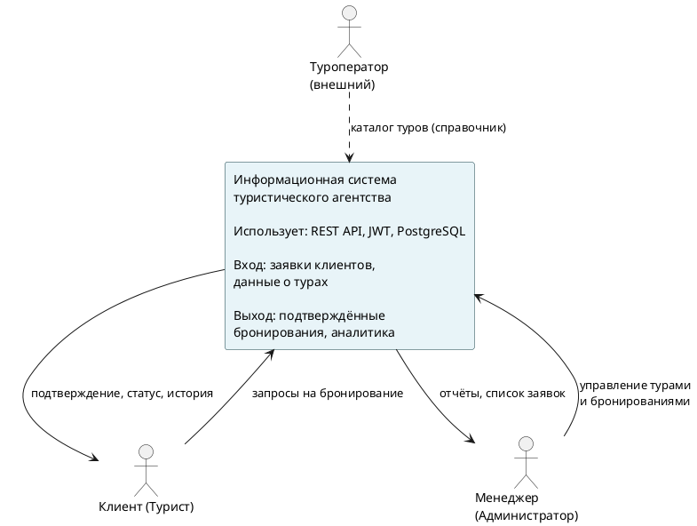

# Этап 0: Инициация и бизнес-анализ

## Паспорт проекта

**1. ОБЩАЯ ИНФОРМАЦИЯ**

- Название проекта: Информационная система туристического агентства
- Траектория: В (Мобильная разработка)
- Дата начала: 01.03.2026 | Плановая дата завершения: 30.05.2026

**2. БИЗНЕС-КОНТЕКСТ**

Проблема: Туристические агентства среднего масштаба используют устаревшие методы обработки заявок — телефонные звонки и электронные таблицы. Клиенты не имеют возможности самостоятельно просматривать каталог туров, сравнивать цены и оформлять бронирования в удобное время.

Решение: Мобильное приложение с серверной частью на Spring Boot позволяет клиентам агентства самостоятельно просматривать каталог, бронировать туры и отслеживать статус своих заявок в режиме реального времени. Администраторы получают инструмент управления турами и бронированиями через мобильный интерфейс.

**3. ЦЕЛИ ПРОЕКТА**

- Обеспечить клиентам круглосуточный доступ к каталогу туров через мобильное приложение
- Автоматизировать процесс бронирования и подтверждения заявок
- Снизить нагрузку на менеджеров агентства за счёт самообслуживания клиентов
- Повысить уровень удовлетворённости клиентов за счёт прозрачности статусов бронирований

**4. КЛЮЧЕВЫЕ ПОКАЗАТЕЛИ УСПЕХА**

- Время оформления бронирования: менее 3 минут
- Количество экранов мобильного приложения: не менее 5
- Количество REST-эндпоинтов: не менее 8
- Покрытие модульными тестами: более 40%

**5. КЛЮЧЕВЫЕ РИСКИ**

- Риск нестабильности сети на клиентском устройстве → офлайн-обработка ошибок (try/catch + Alert)
- Риск просрочки токена → автоматическая очистка AsyncStorage при 401-ошибке

## Диаграмма бизнес-контекста IDEF0 A-0

## BUC-диаграмма (бизнес-прецеденты)

| № | Бизнес-прецедент | Актор | Результат |
|---|---|---|---|
| BUC-1 | Выбор и бронирование тура | Клиент | Оформленная заявка |
| BUC-2 | Отмена поездки | Клиент | Освобождение мест |
| BUC-3 | Просмотр истории поездок | Клиент | Список бронирований |
| BUC-4 | Публикация тура в каталоге | Администратор | Новый тур для клиентов |
| BUC-5 | Подтверждение заявки | Администратор | Статус CONFIRMED |
| BUC-6 | Мониторинг загруженности | Администратор | Статистика по бронированиям |

## Матрица стейкхолдеров

| Стейкхолдер | Роль | Интерес | Влияние |
|---|---|---|---|
| Клиент (турист) | Пользователь | Удобное бронирование, актуальный каталог | Высокое |
| Менеджер агентства | Администратор | Быстрое управление заявками | Высокое |
| Руководство агентства | Владелец | Рост продаж, снижение операционных затрат | Высокое |
| IT-отдел СКФУ | Преподаватель | Соответствие архитектуре PCMEF | Среднее |

## SWOT-анализ текущего процесса

| | Положительное | Отрицательное |
|---|---|---|
| **Внутреннее** | Опытные менеджеры; наработанная база клиентов | Ручная обработка заявок; нет онлайн-каталога |
| **Внешнее** | Рост мобильного туризма; доступность облачных решений | Конкуренция с крупными агрегаторами (Booking, TripAdvisor) |

## Бизнес-глоссарий (15+ терминов)

| Термин | Определение |
|---|---|
| Тур | Организованная туристическая поездка с фиксированным маршрутом, датами и стоимостью |
| Бронирование | Документально оформленный запрос клиента на участие в туре |
| Направление (Country) | Страна назначения, для которой предлагаются туры |
| Доступные места | Количество свободных мест в туре на текущий момент |
| Статус бронирования | Текущее состояние заявки: PENDING / CONFIRMED / CANCELLED |
| Код подтверждения | Уникальный идентификатор бронирования (UUID) |
| Менеджер | Сотрудник агентства с правами администратора системы |
| Отзыв | Оценка и комментарий туриста о совершённом туре (1–5 звёзд) |
| Личный кабинет | Персональный раздел приложения с историей и профилем |
| Аутентификация | Процесс проверки личности пользователя по email/паролю |
| JWT | JSON Web Token — токен доступа, подтверждающий аутентификацию |
| ROLE_USER | Роль туриста — доступ к каталогу и бронированиям |
| ROLE_ADMIN | Роль администратора — полный доступ к системе управления |
| Пагинация | Разбивка списка туров на страницы для удобства просмотра |
| Итоговая стоимость | Цена тура × количество туристов |
| Мягкое удаление | Деактивация тура без физического удаления записи из БД |
