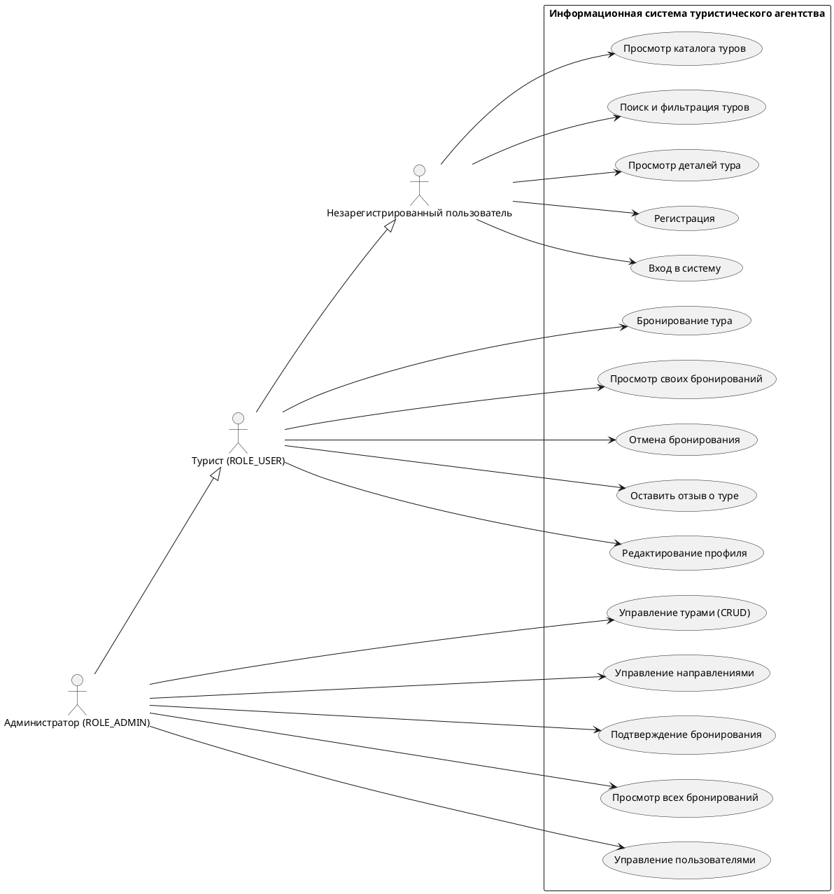

# Модель требований

## Use Case диаграмма

## Спецификация прецедентов

### UC6: Бронирование тура

| Атрибут | Значение |
|---|---|
| **Название** | Бронирование тура |
| **Актор** | Турист (ROLE_USER) |
| **Предусловие** | Пользователь аутентифицирован, тур активен и имеет свободные места |
| **Основной поток** | 1. Пользователь открывает экран тура. 2. Нажимает «Забронировать». 3. Выбирает количество туристов. 4. Система рассчитывает итоговую стоимость. 5. Пользователь подтверждает бронирование. 6. Система резервирует места (Tour.reservePlaces). 7. Создаётся Booking с уникальным кодом подтверждения. 8. Статус: PENDING. |
| **Альтернативный поток** | 3a. Доступных мест меньше запрошенного → сообщение об ошибке |
| **Постусловие** | Booking создан, available_places в Tour уменьшено |
| **REST** | `POST /api/bookings/tour/{tourId}` |

---

### UC2: Поиск и фильтрация туров

| Атрибут | Значение |
|---|---|
| **Название** | Поиск и фильтрация туров |
| **Актор** | Незарегистрированный пользователь / Турист |
| **Предусловие** | Нет |
| **Основной поток** | 1. Пользователь вводит ключевое слово и/или выбирает страну и диапазон цены. 2. Система выполняет поиск с пагинацией. 3. Отображается список туров, соответствующих критериям. |
| **Альтернативный поток** | Нет результатов → экран EmptyState |
| **Постусловие** | Отображён отфильтрованный список туров |
| **REST** | `GET /api/tours/search?keyword=&countryId=&minPrice=&maxPrice=` |

## Глоссарий терминов

| Термин | Определение |
|---|---|
| Тур | Организованная поездка с фиксированной датой, ценой и числом мест |
| Бронирование | Резервирование мест на тур пользователем с фиксацией итоговой стоимости |
| Код подтверждения | Уникальный UUID, идентифицирующий бронирование |
| Направление (Country) | Страна, для которой агентство предлагает туры |
| PENDING | Бронирование создано, ожидает подтверждения администратором |
| CONFIRMED | Бронирование подтверждено |
| CANCELLED | Бронирование отменено; места возвращены в тур |
| JWT | JSON Web Token — токен аутентификации, хранится в AsyncStorage |
| PCMEF | Архитектурный паттерн (Presentation-Control-Mediator-Entity-Foundation) |
