# Архитектурная диаграмма PCMEF

## Диаграмма пакетов

```plantuml
@startuml
allowmixing
title Архитектура информационной системы туристического агентства\n(PCMEF + Mobile Client)

skinparam packageStyle rectangle
skinparam backgroundColor #F7F4EF
skinparam ArrowColor #0E3B43

' ── Интерфейсы (контракты между слоями) ──────────────────────
interface "IAuthService"     as IAuth
interface "ITourService"     as ITour
interface "IBookingService"  as IBook
interface "IReviewService"   as IRev
interface "ICountryService"  as ICnt
interface "IUserService"     as IUsr

' ── Mobile Client (Presentation) ─────────────────────────────
package "Presentation (React Native)" #E8F4F8 {
  rectangle "LoginScreen"       as P1
  rectangle "RegisterScreen"    as P2
  rectangle "HomeScreen"        as P3
  rectangle "TourListScreen"    as P4
  rectangle "TourDetailScreen"  as P5
  rectangle "BookingScreen"     as P6
  rectangle "MyBookingsScreen"  as P7
  rectangle "ProfileScreen"     as P8
  rectangle "AdminScreen"       as P9
}

' ── Backend ───────────────────────────────────────────────────
package "Server (Spring Boot)" {

  package "Control" #DDEEFF {
    rectangle "AuthController"    as C1
    rectangle "TourController"    as C2
    rectangle "BookingController" as C3
    rectangle "ReviewController"  as C4
    rectangle "CountryController" as C5
    rectangle "UserController"    as C6
  }

  package "Mediator" #DDFFD4 {
    rectangle "AuthServiceImpl"    as M1
    rectangle "TourServiceImpl"    as M2
    rectangle "BookingServiceImpl" as M3
    rectangle "ReviewServiceImpl"  as M4
    rectangle "CountryServiceImpl" as M5
    rectangle "UserServiceImpl"    as M6
  }

  package "Entity" #FFF5CC {
    rectangle "User"    as E1
    rectangle "Tour"    as E2
    rectangle "Booking" as E3
    rectangle "Review"  as E4
    rectangle "Country" as E5
    rectangle "Role"    as E6
  }

  package "Foundation" #FFE0CC {
    rectangle "UserRepository"    as F1
    rectangle "TourRepository"    as F2
    rectangle "BookingRepository" as F3
    rectangle "ReviewRepository"  as F4
    rectangle "CountryRepository" as F5
    rectangle "RoleRepository"    as F6
  }
}

database "PostgreSQL" as DB

' ── Зависимости (строго сверху вниз) ─────────────────────────
"Presentation (React Native)" --> "Control" : REST / JSON

C1 --> IAuth
C2 --> ITour
C3 --> IBook
C4 --> IRev
C5 --> ICnt
C6 --> IUsr

M1 ..|> IAuth
M2 ..|> ITour
M3 ..|> IBook
M4 ..|> IRev
M5 ..|> ICnt
M6 ..|> IUsr

M1 --> E1 : использует
M2 --> E2 : использует
M3 --> E3 : использует
M4 --> E4 : использует
M5 --> E5 : использует
M6 --> E1 : использует

M1 --> F1 : Spring Data
M2 --> F2
M3 --> F3
M4 --> F4
M5 --> F5
M1 --> F6

F1 --> DB : JDBC / JPA
F2 --> DB
F3 --> DB
F4 --> DB
F5 --> DB
F6 --> DB

@enduml
```

Сохранить диаграмму как изображение и поместить в `docs/images/pcmef-diagram.png`.

## Ключевые архитектурные решения (ADR)

### ADR-01: Выбор Spring Boot как серверного фреймворка
- **Контекст:** Необходим фреймворк для Java 17+, поддерживающий Spring Data JPA, Spring Security
- **Решение:** Spring Boot 3.3
- **Причина:** Встроенный IoC, автоконфигурация, зрелая экосистема Spring Security + JWT

### ADR-02: React Native вместо нативного Android
- **Контекст:** Нужен мобильный клиент для Android (iOS опционально)
- **Решение:** React Native + Expo
- **Причина:** Максимальное переиспользование кода с исходным веб-проектом (те же API-вызовы, логика навигации), единая кодовая база для Android/iOS

### ADR-03: JWT без refresh-токенов (базовая реализация)
- **Контекст:** Требуется аутентификация через JWT
- **Решение:** Access-токен 1 час, хранится в AsyncStorage
- **Причина:** Упрощение реализации для учебного проекта. Refresh-токены — бонусное задание

### ADR-04: Мягкое удаление туров (soft delete)
- **Контекст:** Удаление тура не должно нарушать историю бронирований
- **Решение:** Поле `active = false` вместо физического DELETE
- **Причина:** Ссылочная целостность: Booking → Tour требует существования записи Tour
