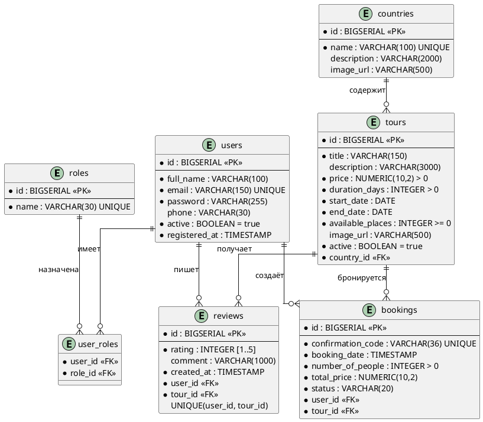

# Проектирование базы данных

## ER-диаграмма

## Описание таблиц

| Таблица | Назначение | NF |
|---|---|---|
| roles | Роли (ROLE_USER, ROLE_ADMIN) | 3НФ |
| users | Пользователи | 3НФ |
| user_roles | Связь пользователей с ролями (M:N) | 3НФ |
| countries | Страны и направления | 3НФ |
| tours | Туры | 3НФ |
| bookings | Бронирования | 3НФ |
| reviews | Отзывы (уникальность: 1 отзыв/пользователь/тур) | 3НФ |

DDL-скрипт: [`../../database/ddl.sql`](../../database/ddl.sql)

## Стратегия ORM (маппинг Entity → таблица)

| JPA-сущность | Таблица | Особенности |
|---|---|---|
| `User` | `users` | `@UniqueConstraint(email)` |
| `Role` | `roles` | `@Enumerated(STRING)` |
| `Country` | `countries` | — |
| `Tour` | `tours` | `@ManyToOne(country)`, soft delete через `active` |
| `Booking` | `bookings` | `@Enumerated(STRING)` для status |
| `Review` | `reviews` | `@Table(uniqueConstraints = {user_id, tour_id})` |
