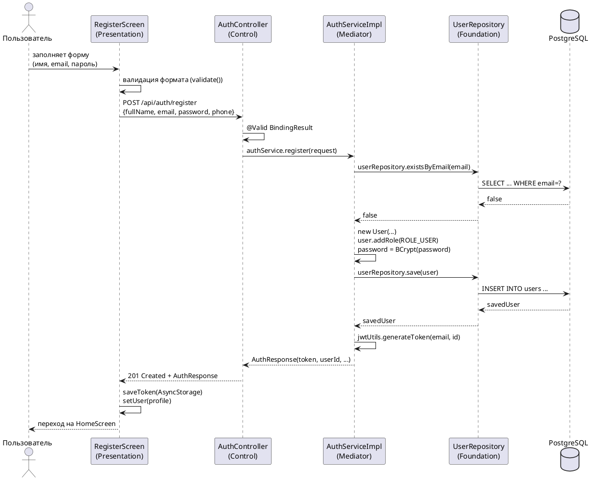
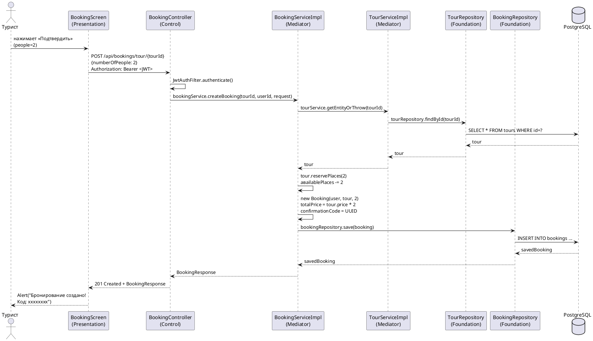
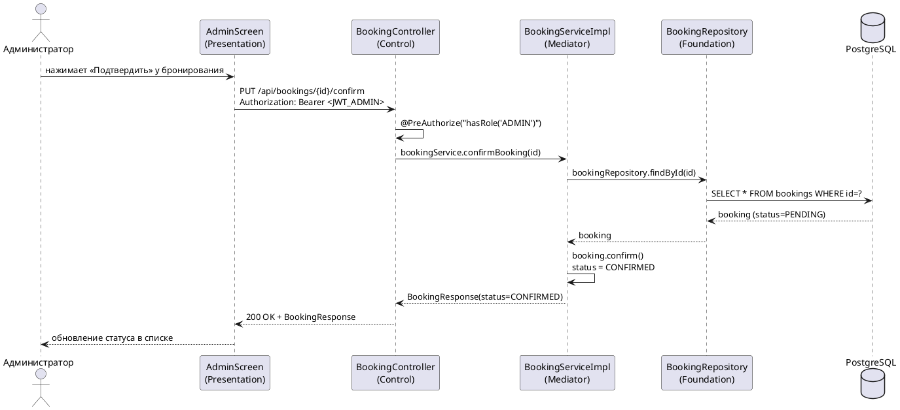

# Диаграммы последовательности

## Сценарий 1: Регистрация нового пользователя (UC4)

---

## Сценарий 2: Бронирование тура (UC6)

---

## Сценарий 3: Администратор подтверждает бронирование (UC13)

